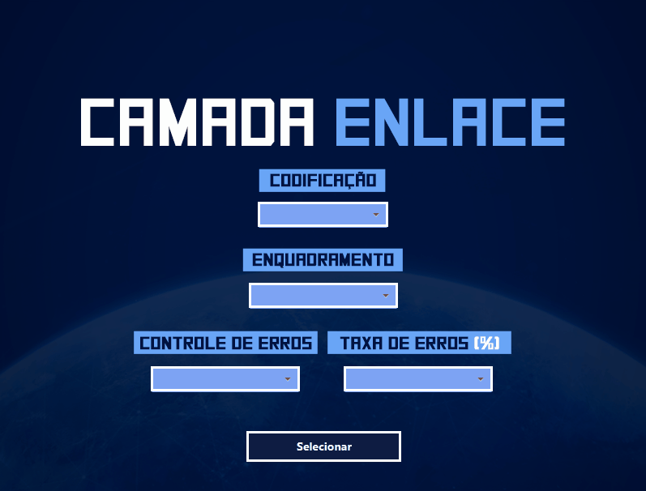

# Camada Enlace de Dados - Parte 2
 Este projeto foi concebido e implementado como parte da disciplina de Redes, realizada durante o quarto semestre do curso de Ciência da Computação na Universidade Estadual do Sudoeste da Bahia (UESB), fazendo uso da linguagem de programação Java.

# Sobre
O trabalho envolve uma simulação da Camada Enlace de Dados do Modelo OSI
NOTA DO TRABALHO (100 / 100)

 # Execução
**Algumas Informações IMPORTANTES da execução são exibidas no terminal.**
 

 
Execução parcial do programa.

# Autores
[@CarlosGilM](https://github.com/CarlosGilM)
